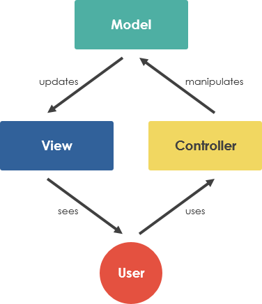

# Express.js_API
For my first RESTful API I used Node/Express, the nodemon package to save time on restarting the server,
Postman to test my endpoints, Handlebars as the templating engine and some basic html and css.

## The MVC Pattern

The MVC design pattern is a popular choice among developers using Express for structuring their applications. In simplified terms:

The controller processes the user's request and then manipulates the model accordingly.
For example: adding or removing data from a database.

The model is a representation of how the Express app sees the data.
It can translate the data, as it lives in storage, to how the data is actually used by the application.

The view is how the data from the model is being presented back to the user. This is where React might step-in and take control.

A simple diagram of the model:

MVC is meant to simplify our code and make it easier to read, update and improve.

## Testing with Postman

The slight difference between the time it takes on our log and the postman is that 
it takes more time for the response to make it back all the way to postman.